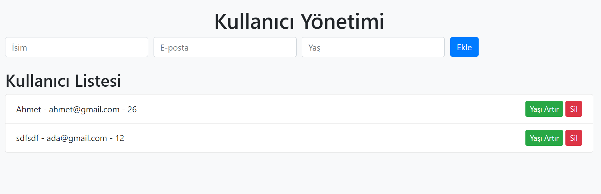

# Kullanıcı Yönetimi Uygulaması

Bu proje, FastAPI ve SQLAlchemy kullanarak basit bir kullanıcı yönetimi uygulamasıdır. Uygulama, kullanıcı ekleme, güncelleme, silme ve listeleme işlevselliği sunmaktadır.
app.py ORM kullanmadan ormapp.py SQLALchemy ORM kullanılarak kodlanmıştır.



## Özellikler

- Kullanıcı ekleme
- Kullanıcı güncelleme (yaş artırma)
- Kullanıcı silme
- Kullanıcı listeleme

## Gereksinimler

Projenin çalışması için aşağıdaki kütüphanelerin yüklü olması gerekmektedir:

- FastAPI
- Uvicorn
- SQLAlchemy
- Aiosqlite
- Jinja2

## Kurulum

1. Bu projeyi klonlayın veya indirin:

   ```bash
   git clone <repository-url>
   cd <repository-directory>
   ```

2. Gerekli kütüphaneleri yüklemek için `requirements.txt` dosyasını kullanın:

   ```bash
   pip install -r requirements.txt
   ```

## Çalıştırma

Uygulamayı başlatmak için aşağıdaki komutu çalıştırın:


```bash
uvicorn app:app --reload  
uvicorn ormapp:app --reload 
```

Tarayıcınızda `http://127.0.0.1:8000` adresine giderek uygulamayı görüntüleyebilirsiniz.

## Kullanım

- Kullanıcı eklemek için formu doldurun ve "Ekle" butonuna tıklayın.
- Kullanıcıların yaşını artırmak için "Yaşı Artır" butonuna tıklayın.
- Kullanıcıları silmek için "Sil" butonuna tıklayın.
- Tüm kullanıcılar, ana sayfada listelenecektir.


## Lisans

Bu proje MIT lisansı altında lisanslanmıştır.
